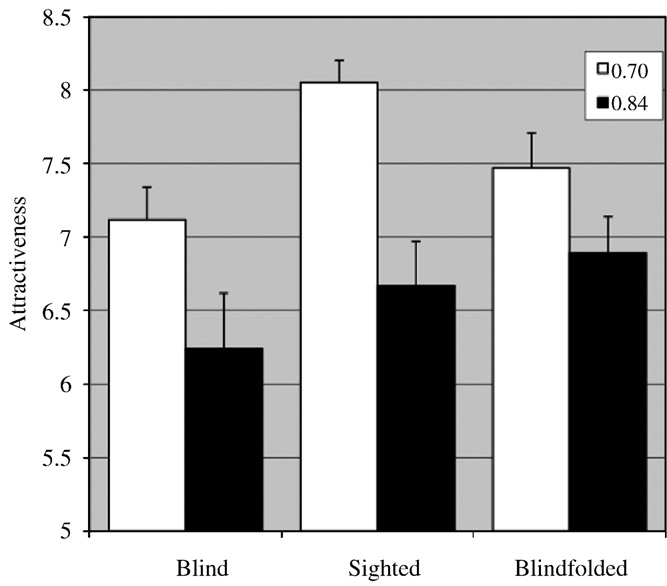

### Blind men prefer a low waist-to-hip ratio

**Authors**: Johan C. KARREMANS, Willem E. FRANKENHUIS, Sander ARONS

**Presenter**: CUI Tianxiang

2022.09.06

---

### Contents

- Introduction
- Methods
- Results
- Discussion
- Limitations

---

### Introduction

- Males prefer females with a low waist-to-hip ratio (WHR)
  - An indication of health and fertility
  - A biological characteristic
  - A psychological mechanism of responding to exaggerated features

---

### Introduction

- A cross-cultural preference for low WHR
  - In different populations: Caucasians, Hispanics, Indonesians, and Kenyans
- WHR preferences differ between cultures
  - Local ecology (e.g., the amount of food)
  - Cultural transmission

---

### Introduction

- The role of visual input in the preference for low WHR
  - Visual learning: the feature of low WHR
  - Children's observation
  - The influence of Western media

---

### Introduction

- What about congenitally blind men?
  - Lack the preference for low WHR (no visual experience)
  - Have a less pronounced preference for low WHR than sighted men
  - Exhibit a preference for low WHR as strong as their sighted counterparts

---

### Methods

- Participants and design
  - 19 **congenitally blind men** (27-72 years old, *Mage* = 46.5, *SD* = 14.43)
    - 2 were excluded from data analysis
  - 38 **sighted men** were randomly assigned
    - 19 in the **sighted condition** (23-69 years old, *Mage* = 45.4, *SD* = 14.90)
    - 19 in the **blindfolded condition** (25-68 years old, *Mage* = 44.5, *SD* = 14.75)

---

### Methods

- Procedure and materials
  - The experiment was conducted inside a van
  - Two female mannequin dolls
    - Identical in dressing, differ in WHR (0.70 and 0.84)
    - Similar volumes
    - BMI is a irrelavant variable

---

### Methods

- Procedure and materials
  - Why 0.70 and 0.84 for WHRs?
    - In Western populations, attractiveness ratings generally peak at around 0.70
    - Average female WHRs in Western populations range from 0.76 up to 0.84
    - Pilot study: normal range

---

### Methods

- Procedure and materials
  - The blind participants inspected the body and rated the attractiveness
    - The grade ranges from 1 to 10, with 10 representing very attractive and 1 very unattractive
  - Participants in the **sighted condition**
    - Looked at the bodies and rate their attractiveness

---

### Methods
- Procedure and materials
  - Participants in the **blindfolded condition**
    - The same procedure as the blind participants

---

### Results

- ANOVA
  - The within-participants variable: the ratings for the two bodies with the different WHRs (0.70 and 0.84)
  - Between-participants variables: group (blind, sighted, and blindfolded) and order of rating (first 0.70 versus first 0.84)

---

### Results
- ANOVA
  - A significant main effect of WHR (participants overall preferred a lower WHR)
  - No other significant effects (main effects of group, interactions of WHR with group, WHR with order, and the The three-way interaction between WHR, order, and group)

---

### Results

- Paired *t* tests within each group: significant effects of WHR

  - Blind group, *d* = 0.68
  - Sighted group, *d* = 1.33
  - Blindfolded group, *d* = 0.54

---

### Results

---

### Discussion

- Visual input is not necessary for low WHR preferences
- Visual input may have strengthened this preference among sighted men
- Why do blind men develop a preference for low WHRs?
  - Verbal information
  - Generic psychological mechanisms / Prototypical stimuli
  - Intrinsic factors

---

## Limitations

- Not feasible to examine preferences of blind and sighted men for a larger number of WHRs
- Did not systematically manipulate some variables
  - Hip size, waist size, and weight
---

## Thank you for your listening!
