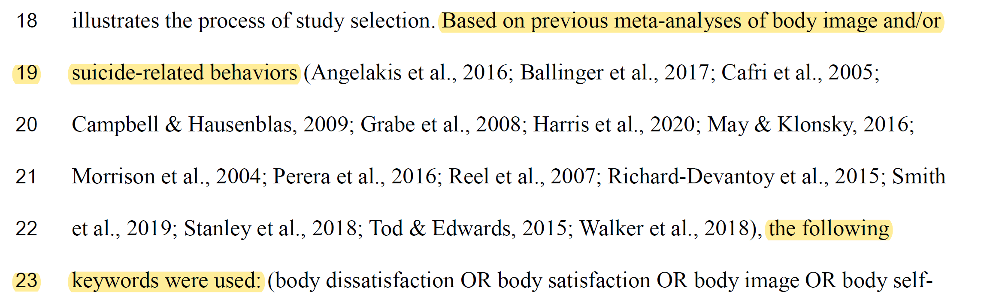
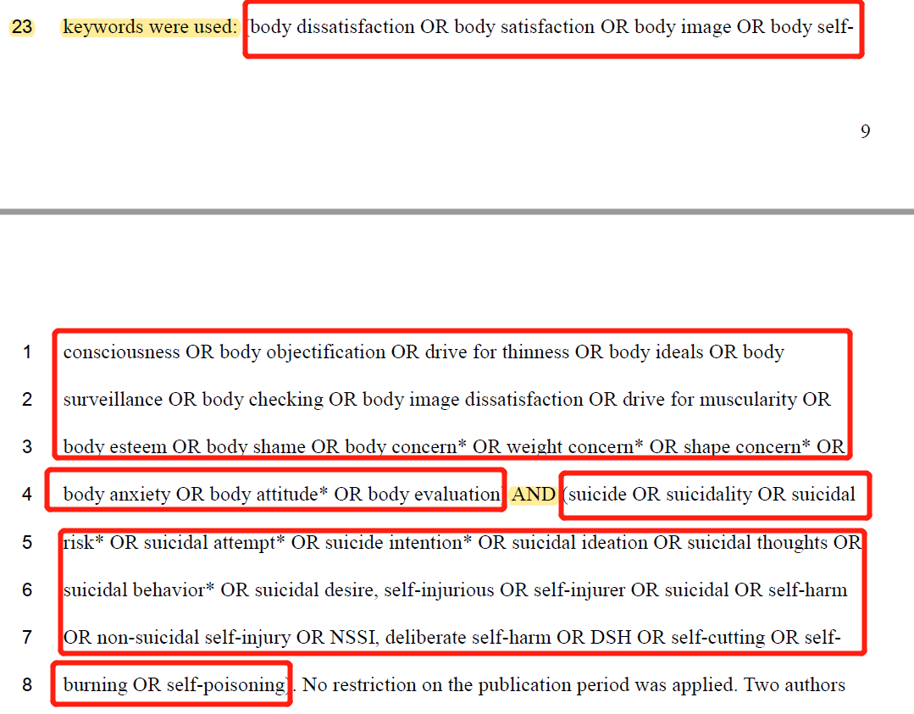
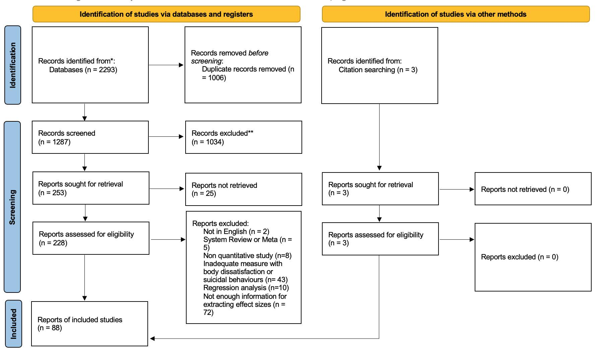

### A Few Notes on Doing Meta-analysis

CUI Tianxiang

2022.11.01

---

### Contents

---
### A Brief Intro

"To perform a meta-analysis we compute an effect size and variance for each study, and then compute a weighted mean of these effect sizes." ([Borenstein et al., 2009](https://onlinelibrary.wiley.com/doi/book/10.1002/9780470743386))

---

### Topic

- The relationship between two constructs

- The effect of an intervention

- The structure of a model

- ...

---

### Keywords
- Refer to previous meta-analyses

---
### Keywords

- Use "\*" when variations are needed (e.g., therap* includes therapy, therapies, theraputic, etc.)

- Use "" to include pharses (e.g., "body image")

- Use "AND" and "OR" correctly

---
### Keywords

---
### Databases

- PsycINFO, Web of Science, PubMed, Scopus, and ProQuest Dissertations & Theses (PQDT)
  - Focus on title and abstract
  - Records (with abstract) → files (RIS / Bibtex...) → reference manager (Zotero / Endnote / Mendeley ...)
- Supplementary: Google Scholar

---
### Records

- Remove duplicates (Zotero seems to work better, but is not perfect)
- Screen title and abstract of the literature by yourself or cooperate with another student (create a shared library or export half of the literature)
- Download potentially qualified articles

---
### Selection Criteria

- General inclusion criteria & exclusion criteria

  - Include English articles, exclude review articles and qualitative studies...

- Specific criteria

  - Depend on the topic

---
### Selection Criteria

- English articles only
  - Language restrictions won’t lead to systematic bias (Morrison et al., 2012).
- Unpublished articles (dissertations)
  - “Time, effort and cost”
  - Easy access, low bias and complete demonstration of findings (Moyer et al., 2010)
  - A better representation of missing study (Ferguson & Brannick, 2012)

---

### Record Important Information 
- Search results
  - Keywords and references
  - Time period (you may need to search literature twice or even three times)
  - Number of articles (total, after removing duplicates, after checking titles and abstracts, after checking the full texts)
- Google Scholar and included articles (check the references)
---
### Flow Diagram

---
### Coding
- Author (s) & year
- Publication year
- Publication type
- Country / region
- Mean age
- Study design
- Effect size & variance
- ...

---

### Effect Size

- [Ellis, 2010](https://www.cambridge.org/core/books/essential-guide-to-effect-sizes/72C26CA99366A19CAC4EF5B16AE3297F) (accessible at UM)

- [Practical Meta-Analysis Effect Size Calculator](https://www.campbellcollaboration.org/escalc/html/EffectSizeCalculator-Home.php)

- [Effect size converter](https://www.escal.site/)

---

### Inter-coder Reliability
- Two coders (code independently then discuss)
- [Krippendorff’s alpha](http://mdcw.socsci.uva.nl/?p=57) (≥ .800)
### Quality Assessment
- Refer to previous studies when choosing tools
- Two coders (code independently then discuss)

---
### Data Analysis
- R & *metafor*
- Consider a three-level meta-analysis when single study is likely to contain multiple effect sizes
  - Heterogeneity from three levels of variance: the sampling variance of effect sizes, within-study variance, and the
between-study variance
  - [Assink & Wibbelink, 2016](https://doi.org/10.20982/tqmp.12.3.p154)

---

### Outliers & Pooled effect sizes

- Baujat plots and influential case diagnostics

- A pooled effect size with outliers excluded

- Forest plot for the effect sizes

---

### heterogeneity among effect sizes

- Q statistics (*p* < .05) indicate a significant heterogeneity

- Meta-regression analyses of potential moderators (age, region, data source, etc.)
  
  - For continuous variables, at least 10 effect sizes
  
  - For categorical variables, at least 3 effect sizes for the subgroup of a variable

---

### Publication Bias

- Funnel plots
- The *p*-uniform* method

---
### Thank you for your listening!
