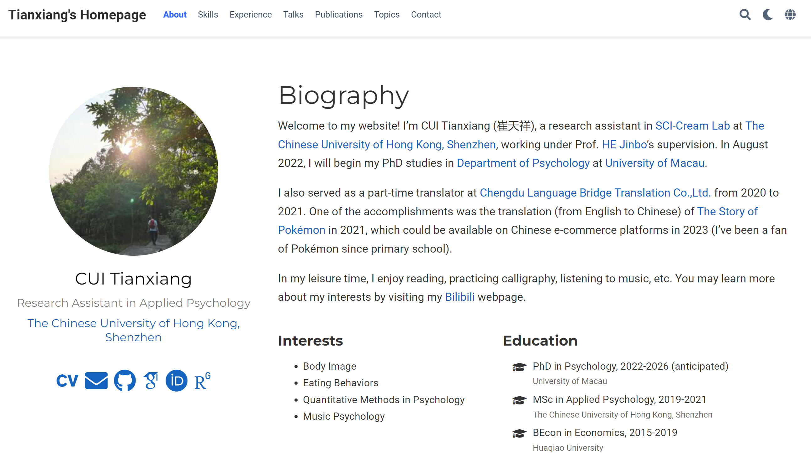

## 心理学申博分享——以港澳地区为例

崔天祥

2022.5.14

---

### 关于我

个人主页：https://cuitx.netlify.app/

---

### 在港中深的求学时光

- 2019年下半年
  - 磕磕绊绊：全英授课、课程难度、专注程度、慢热？
  - 加入何老师实验室，学习研究方法，训练学术写作
- 2020年
  - 略有起色：论文写作&研究方法
- 2021年
  - 逐渐坚定：gap一年用来提升自我和申博

---

### 申博时间线------择校

- 2021年7月开始在各学校官网查询导师信息（加粗的表示有正式申请）
  - 香港大学
  - **香港中文大学（公共卫生）**
  - **香港理工大学（应用社科：心理学，精神卫生与健康）**
  - 香港城市大学
  - **香港浸会大学（运动与体育）**
  - **澳门大学（心理学）**

---

### 申博时间线------联系导师

- 2021年8月末开始邮件联系导师，持续到10月末

  - 共联系了约**15**位导师

  - 有积极回复的约**5**位

  - 有消极回复或有些敷衍的约**4**位

  - 面谈过**2**位（澳门大学和香港理工大学）

  - 正式面试**1**次（香港浸会大学）

---

### 申博时间线------科研

- 2021年7月份，第一篇期刊论文接收（第一作者）

- 2021年10月份，参加粤港澳大湾区心理学会议
  
  - 有三篇参与的论文接收（一篇一作），海报展示；两篇获奖

---

### 申博时间线------科研

- 2021年10月份，两篇论文做出了初步结果（有摘要）

- 2021年11月份，参加中国心理学会的会议

  - 与期刊论文为同一篇；口头汇报
 
  - 符合期刊出版社的要求，且获得了会议负责人的同意

---

### 申博时间线------正式申请

- 2021年10月28日前

  - 澳门大学

- 2021年12月1日前

  - 港校（港中文需要纸质材料；港浸会无法提交彩色材料，需要转换成黑白色）

- 缴费：银联比较方便；港浸会可以用支付宝支付

---

### 申博时间线------语言成绩

- 11月末考了雅思

  - 仅靠英文授课证明可能不够

  - 最好再考一次语言成绩以增加优势（尤其是语言成绩过期了的话）

---

### 感想与补充

- 积极参与研究项目

- 对于申请的导师需要了解更充分

- 注意截止日期

- [实验室公众号的推文](https://mp.weixin.qq.com/s/VuNvgwQ_eGvYmqNe4zsPtQ)

---

## 谢谢大家
